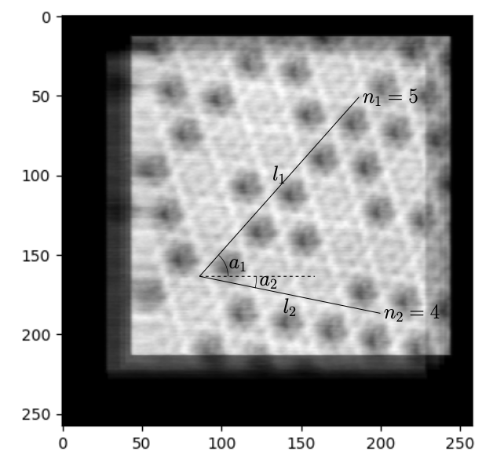
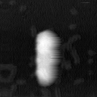

# afm_piezo_calibration
calibration python scripts for AFM xy- and z-piezo constants based on Annexin V and gold nanorods

## calibration for xy-piezo constants ##

1. get a well-aligend and averaged Annexin V image
2. measure the length ($l_1$ and $l_2$ in pixels), lattice number ($n_1$ and $n_2$) and angles ($a_1$ and $a_2$ in degrees) of two line segments along Annexin V lattices
3. nominal pixel scale ($s$ in nm/pixel) as a pre-known parameter
4. run the script `python xy_cali_l_n_a_s.py [l1] [n1] [a1] [l2] [n2] [a2] [s]`

## calibration for z-piezo constants ##

1. get a set of AFM images of gold nanorods
2. preprocess images: remove unuseful frames
3. run the script `python z_cali_f.py [file_path]`
4. repeat `step 3` and make histograms of measured heights of gold nanorods

